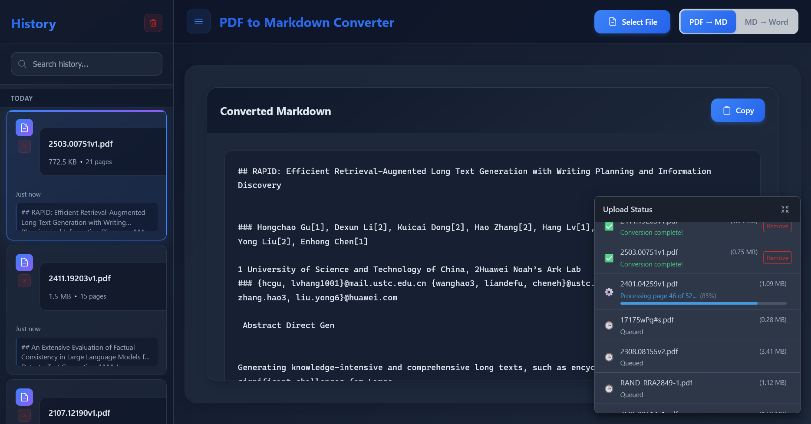
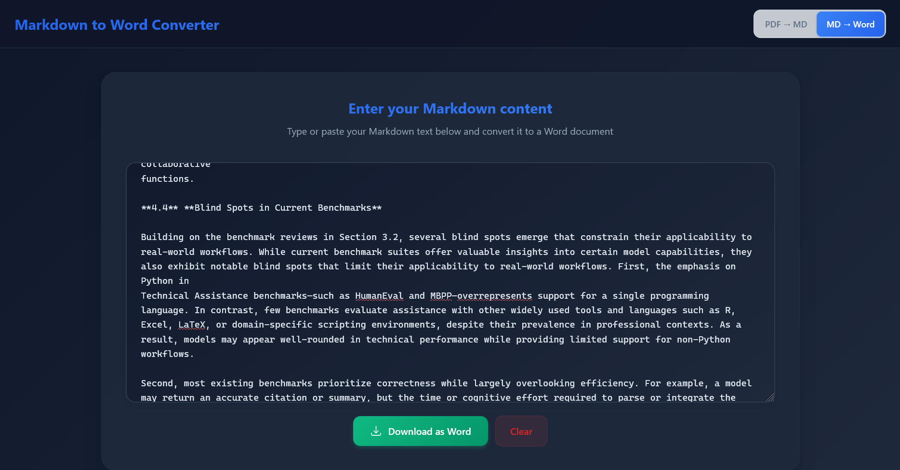

# Ink2MD - Handwritten PDF to Markdown Converter

[](https://www.gnu.org/licenses/agpl-3.0)

Ink2MD is a specialized web application designed for efficient conversion of handwritten PDF documents (especially Rocketbook files) into well-structured Markdown format. It features a React-based frontend and a Python Flask backend with AI-powered handwriting recognition, providing a seamless user experience with real-time progress updates.

## Attribution

This project is based on [PDF3MD](https://github.com/murtaza-nasir/pdf3md) by Murtaza Nsair.
Licensed under GNU Affero General Public License v3.0.

### Modifications for Ink2MD
- Enhanced AI service abstraction layer with Anthropic Claude and Ollama integration
- SQLite database for conversion history and retry management
- Configuration management system with environment variable support
- Rocketbook and handwriting-optimized processing pipeline
- Removed MS Word conversion features to focus on PDF-to-Markdown
- Specialized for handwritten text recognition (HTR) and ink-based documents

## Screenshots



## Core Features

-   **Handwritten PDF to Markdown Conversion**: Transforms handwritten PDF documents (like Rocketbook pages) into clean, readable Markdown using AI-powered HTR
-   **Multi-File Upload**: Supports uploading and processing multiple PDF files simultaneously
-   **AI-Powered Processing**: Configurable AI providers (Anthropic Claude, Ollama) for text recognition and formatting
-   **Conversion History**: SQLite database tracking with retry capabilities and statistics
-   **Drag & Drop Interface**: User-friendly file uploads via drag and drop or traditional file selection
-   **Real-time Progress Tracking**: Detailed status updates during the conversion process for each file
-   **Configuration Management**: Web-based configuration with environment variable support
-   **Modern and Responsive UI**: Intuitive interface designed for ease of use across various devices

## Technology Stack

-   **Frontend**: React, Vite
-   **Backend**: Python, Flask
-   **PDF Processing**: PyMuPDF4LLM
-   **AI Services**: Anthropic Claude, Ollama (LLaVA, Mistral)
-   **Database**: SQLite
-   **Configuration**: JSON with environment variable substitution

## Getting Started

The easiest and recommended way to run Ink2MD is using the provided Docker quick start script.

### Prerequisites

-   Docker Engine
-   Docker Compose (typically included with Docker Desktop)
-   (Optional) Anthropic API key for Claude integration
-   (Optional) Ollama server for local AI processing

### Using Pre-built Docker Images (Recommended)

This method uses pre-built Docker images from Docker Hub for quick setup. You'll need the `docker-compose.yml` and `docker-start.sh` script from the repository.

1.  **Prepare Required Files**:
    *   Create a directory for your application (e.g., `mkdir ink2md-app && cd ink2md-app`).
    *   **`docker-compose.yml`**: Create a file named `docker-compose.yml` in this directory and paste the following content into it:
        ```yaml
        services:
          backend:
            image: docker.io/learnedmachine/ink2md-backend:latest 
            container_name: ink2md-backend
            ports:
              - "6201:6201"
            environment:
              - PYTHONUNBUFFERED=1
              - FLASK_ENV=production
              - TZ=America/Chicago
              - ANTHROPIC_API_KEY=${ANTHROPIC_API_KEY}
            volumes:
              - ./config:/app/config
              - ./data:/app/data
              - ./input_pdfs:/app/input_pdfs
              - ./output_markdown:/app/output_markdown
            restart: unless-stopped
            healthcheck:
              test: ["CMD", "curl", "-f", "http://localhost:6201/"]
              interval: 30s
              timeout: 10s
              retries: 3
              start_period: 40s

          frontend:
            image: docker.io/learnedmachine/ink2md-frontend:latest 
            container_name: ink2md-frontend
            ports:
              - "3000:3000"
            depends_on:
              - backend
            restart: unless-stopped
            healthcheck:
              test: ["CMD", "wget", "--no-verbose", "--tries=1", "--spider", "http://localhost:3000/"]
              interval: 30s
              timeout: 10s
              retries: 3
              start_period: 40s

        networks:
          default:
            name: ink2md-network
        ```
    *   **`docker-start.sh`**: Download the `docker-start.sh` script from this repository and place it in the same directory.
    *   Make the script executable: `chmod +x ./docker-start.sh`

2.  **Set up Environment Variables** (Optional):
    Create a `.env` file in the same directory:
    ```bash
    ANTHROPIC_API_KEY=your_anthropic_api_key_here
    ```

3.  **Start in Production Mode**:
    In the directory where you placed `docker-compose.yml` and `docker-start.sh`, run:
    ```bash
    ./docker-start.sh start
    ```
    This will pull the latest images from Docker Hub and start the application.
    -   Access Frontend: `http://localhost:3000`
    -   Access Backend API: `http://localhost:6201`

4.  **Start in Development Mode** (with hot-reloading):
    ```bash
    ./docker-start.sh dev
    ```
    -   Access Frontend (Vite Dev Server): `http://localhost:5173`
    -   Access Backend API: `http://localhost:6201`

5.  **Other Useful Script Commands**:
    ```bash
    ./docker-start.sh stop                  # Stop all services
    ./docker-start.sh status                # Check running services
    ./docker-start.sh logs                  # View logs from services
    ./docker-start.sh rebuild dev           # Rebuild development environment
    ./docker-start.sh help                  # Display all available script commands
    ```

### Development Environment (Using Local Source Code)

1.  **Clone the Repository**:
    ```bash
    git clone https://github.com/your-username/ink2md.git
    cd ink2md
    ```

2.  **Start Services**:
    ```bash
    docker compose -f docker-compose.dev.yml up --build
    ``` 

3.  **Access Application**: 
    - Frontend (Vite): `http://localhost:5173`
    - Backend API: `http://localhost:6201`

### Manual Setup (Running without Docker)

1.  **Clone the Repository**:
    ```bash
    git clone https://github.com/your-username/ink2md.git
    cd ink2md
    ```

#### Backend (Flask)

1.  Navigate to the `ink2md` sub-directory: `cd ink2md`
2.  Install Python dependencies: `pip install -r requirements.txt`
3.  Set environment variables (optional):
    ```bash
    export ANTHROPIC_API_KEY=your_api_key_here
    ```
4.  Start the backend server: `python app.py`
    (The backend will be available at `http://localhost:6201`)

#### Frontend (React)

1.  In a new terminal, navigate to the `ink2md` sub-directory: `cd ink2md`
2.  Install Node.js dependencies: `npm install`
3.  Start the frontend development server: `npm run dev`
    (The frontend will be available at `http://localhost:5173`)

## Configuration

Ink2MD uses a flexible configuration system with automatic defaults and environment variable support.

### Configuration File

The application automatically creates a `config.json` file with default settings. You can modify this file or use the web interface to update configuration.

### AI Provider Setup

#### Anthropic Claude
1. Get an API key from [Anthropic](https://console.anthropic.com/)
2. Set the environment variable: `ANTHROPIC_API_KEY=your_key_here`
3. Configure in the web interface or config file

#### Ollama (Local AI)
1. Install and run [Ollama](https://ollama.ai/)
2. Pull both handwriting recognition and text formatting models - two models are suggested below:
   ```bash
   ollama pull llava:7b        # For handwriting recognition
   ollama pull mistral:7b      # For text formatting
   ```
3. Ensure Ollama is accessible at `http://localhost:11434`

### API Endpoints

Ink2MD provides comprehensive API endpoints for configuration and monitoring:

- `GET /api/config` - Retrieve current configuration
- `POST /api/config` - Update configuration
- `GET /api/history` - Get conversion history
- `GET /api/statistics` - Get conversion statistics
- `GET /api/providers` - List AI providers and status
- `GET /api/health` - System health check

## Usage Instructions

1.  Open the Ink2MD application in your web browser.
2.  Upload one or more handwritten PDF files using the drag-and-drop area or by clicking to select files.
3.  Monitor the real-time progress as each PDF is processed through AI recognition.
4.  Once a file is processed, the resulting Markdown will be displayed.
5.  View conversion history and statistics in the web interface.
6.  Configure AI providers and settings through the configuration interface.

## Troubleshooting

-   **Port Conflicts**: Ensure ports `3000`, `5173` (for dev), and `6201` are not in use by other applications.
-   **AI Provider Issues**: Check API keys and connectivity in the provider status interface.
-   **Docker Issues**: Ensure Docker is running. Try rebuilding images with `docker compose up --build`.
-   **Configuration Problems**: Check the `/api/health` endpoint for system status.

## License

This project is licensed under the **GNU Affero General Public License v3.0 (AGPLv3)**.

[](https://www.gnu.org/licenses/agpl-3.0)

You are free to use, modify, and distribute this software under the terms of the AGPLv3. A key condition of the AGPLv3 is that if you run a modified version on a network server and provide access to it for others, you must also make the source code of your modified version available to those users under the AGPLv3.

You **must** create a file named `LICENSE` in the root of your repository and paste the full text of the [GNU AGPLv3 license](https://www.gnu.org/licenses/agpl-3.0.txt) into it.

## Acknowledgments

-   Based on [PDF3MD](https://github.com/murtaza-nasir/pdf3md) by Murtaza Nsair
-   PDF processing powered by [PyMuPDF4LLM](https://pypi.org/project/pymupdf4llm/)
-   AI integration with [Anthropic Claude](https://www.anthropic.com/) and [Ollama](https://ollama.ai/)
-   Frontend developed with [React](https://reactjs.org/) and [Vite](https://vitejs.dev/)
-   Backend implemented using [Flask](https://flask.palletsprojects.com/)

## Contributing

Feedback, bug reports, and feature suggestions are highly appreciated. Please open an Issue on the GitHub repository.

This project maintains the same AGPLv3 licensing as the original PDF3MD project, ensuring all modifications remain open source.
